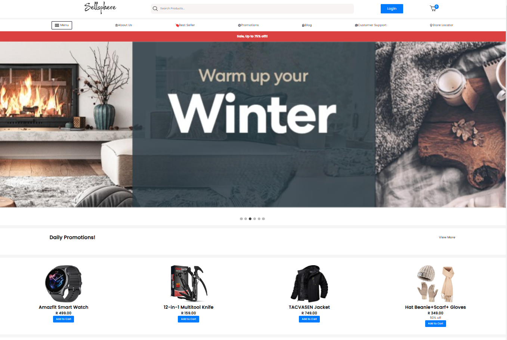
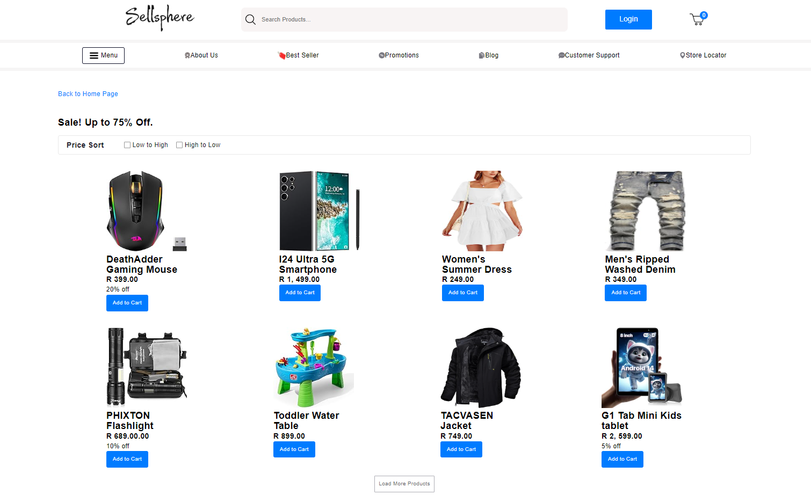
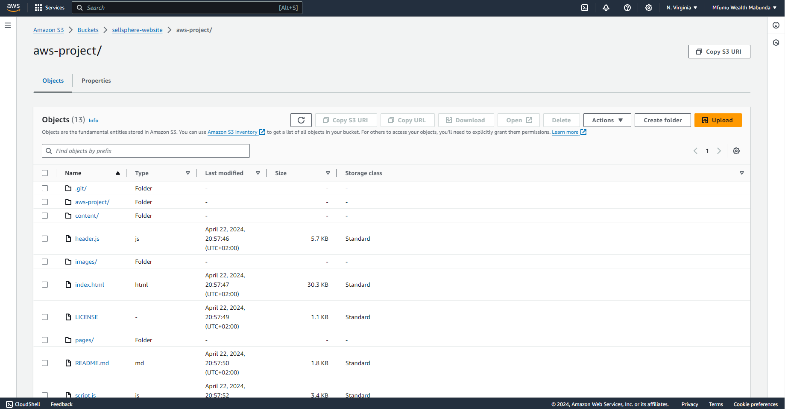
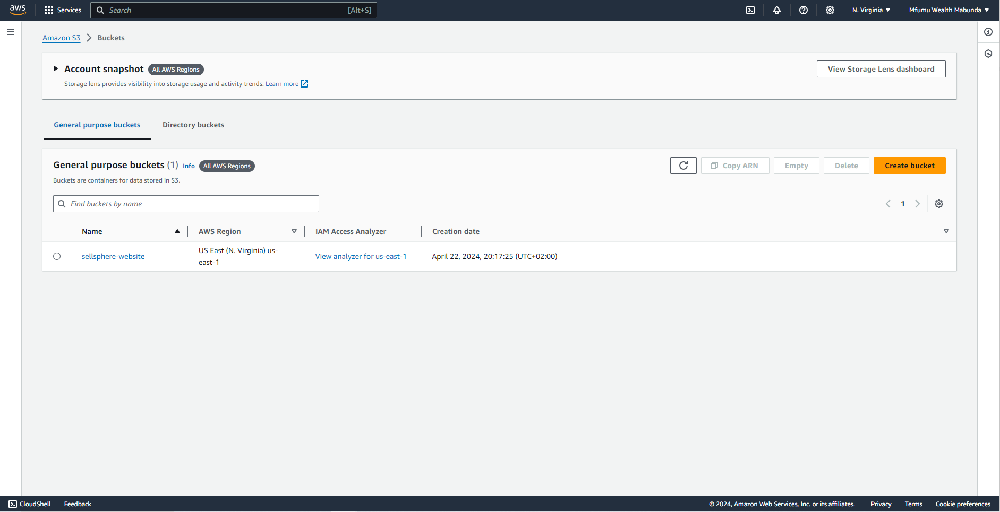

# Sellsphere Marketplace

Sellsphere is a fictional marketplace designed for educational purposes. It is a static web application hosted on Amazon Cloud Services (AWS S3), providing a simulated environment for learning about e-commerce platforms and cloud hosting.

## Features

- **Product Listings**: Browse through a variety of products available for sale.
- **User Authentication**: Register an account or log in to access additional features.
- **Shopping Cart**: Add items to your cart and proceed to checkout.
- **Contact Form**: Reach out to the Sellsphere team for inquiries or support.

## Technologies Used

- **Frontend**:
  - HTML, CSS, JavaScript
- **Backend**:
  - No backend required for a static website
- **Hosting**:
  - Amazon S3 for static website hosting
  - AWS CloudFront for content delivery and security
- **Authentication**:
  - AWS Cognito for user authentication (Optional)

## AWS re/Start Group IV Members

- **Mfumu Wealth Mabunda**
- **Sisipho Mburwana**
- **Palesa Mdakane**
- **Pester Mbhetse**
- **Zamaswazi Dlamini**

## Screenshot

- **Web Browser**

- **AWS Console**

## Purpose

Sellsphere Marketplace serves as an educational tool for understanding web development, cloud hosting, and e-commerce concepts. It provides hands-on experience with building and deploying a static web application using modern technologies and cloud infrastructure.

## Inspiration and Attribution

Sellsphere Marketplace draws inspiration and illustration from real e-commerce platforms like [Amazon.com](https://www.amazon.com/) and [Takealot.com](https://www.takealot.com/) for its design and functionality.

## Disclaimer

Sellsphere Marketplace is a fictional project created solely for educational purposes. Any resemblance to real products, services, or companies is purely coincidental.